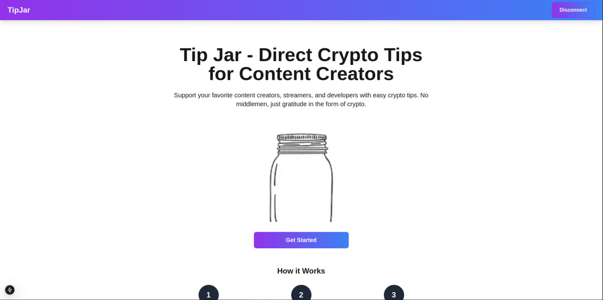
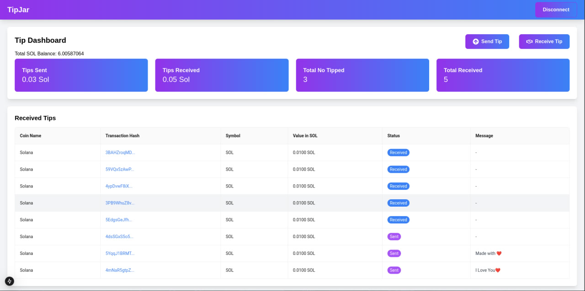

# Tip Jar

Tip Jar is a decentralized tipping platform that allows users to send and receive tips on the Solana blockchain. Users can tip friends and family while attaching a personal message to their transactions.

## Disclaimer 
⚠️ Disclaimer: Use in dev mode! Not responsible for any losses—use a dummy wallet while connecting. 😆

## Features

- **Send Tips**: Easily send SOL tips to friends, family, or any valid Solana wallet address.
- **Attach Messages**: Add a personal message when sending a tip.
- **Receive Tips**: Generate a shareable message with a unique username for easy tip collection.
- **Reown Kit Integration**: Uses Reown AppKit for seamless Web3 login and wallet connections.
- **Supabase Database**: Stores transaction history and user data securely.
- **Built with**: Next.js, TypeScript, Tailwind CSS, Reown Kit, and Supabase.

## Installation Guide

1. **Clone the Repository**:
   ```bash
   git clone https://github.com/canhamzacode/tipjar
   cd tipjar
   ```
2. **Set Up Environment Variables**:
   Rename `.env.example` to `.env` and update the values:
   ```bash
   NEXT_PUBLIC_PROJECT_ID=your_project_id
   NEXT_PUBLIC_SUPABASE_URL=your_supabase_url
   NEXT_PUBLIC_SUPABASE_KEY=your_supabase_key
   ```
3. **Install Dependencies**:
   ```bash
   npm install
   ```
4. **Run the Development Server**:
   ```bash
   npm run dev
   ```
   The app will be available at `http://localhost:3000`.

## Usage

### Sending a Tip
1. Click the **Send Tip** button.
2. Enter the recipient's Solana wallet address or username.
3. (Optional) Attach a personal message.
4. Confirm the transaction and send the tip.

### Receiving a Tip
1. Click the **Receive Tip** button.
2. Copy the generated message, which looks like this:
   ```
   Visit http://localhost:3000 and send a tip to the username: 8FzZYpsa
   ```
3. Share the message with others so they can tip you easily.

## Future Updates
- **Email Integration**: Users will be able to register an email.
- **Profile Updates**: Users can customize their usernames.
- **Enhanced Security & Features**: More control over transactions and tipping options.

## License
This project is open-source under the **MIT License**.

## Built by
Made with ❤️ by [Hamza (CanHamzaCode)](https://x.com/canhamzacode)


## Screenshots

